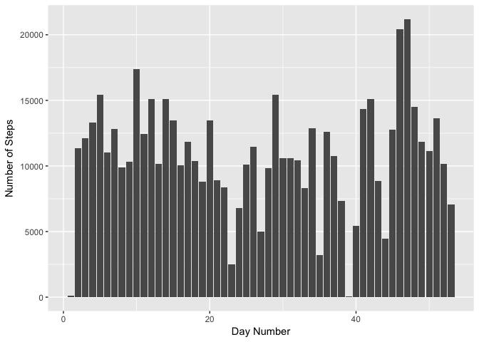
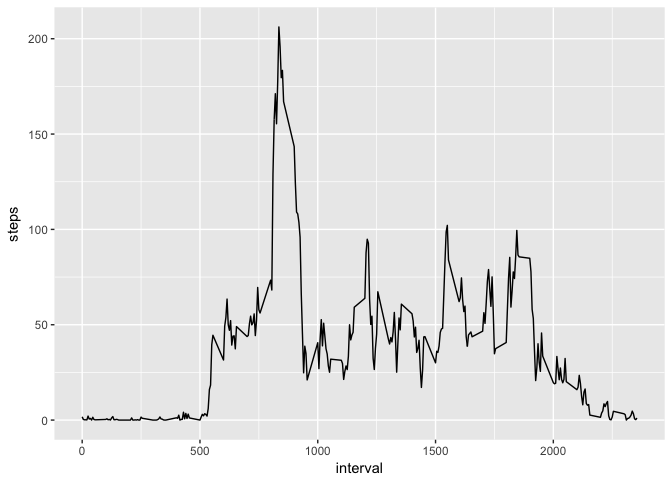
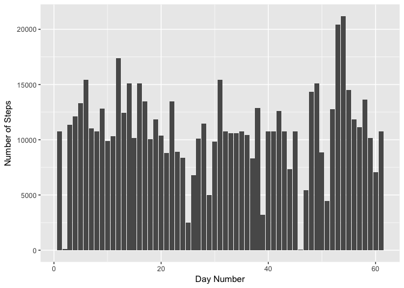
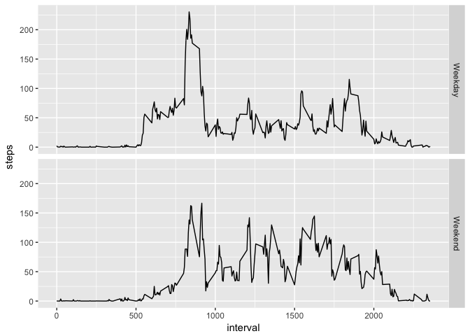

# Reproducible Research: Peer Assessment 1


## Loading and preprocessing the data

```r
activityData <- read.csv("activity.csv", stringsAsFactors = FALSE)
```


## What is mean total number of steps taken per day?

```r
stepsByDay <- aggregate(steps ~ date, data = activityData, FUN = sum)
stepsByDay$day <- 1:nrow(stepsByDay)

library(ggplot2)
g <- ggplot(stepsByDay, aes(day))
g + geom_bar(aes(weight=steps)) +
  labs(x = "Day Number", y = "Number of Steps")
```

<!-- -->

Mean number of steps taken per day 

```r
mean(stepsByDay$steps)
```

```
## [1] 10766.19
```

Median number of steps taken per day 

```r
median(stepsByDay$steps)
```

```
## [1] 10765
```

## What is the average daily activity pattern?

```r
avgDailyActivity <- aggregate(steps ~ interval, data = activityData, FUN = mean)

g <- ggplot(avgDailyActivity, aes(interval, steps))
g + geom_line()
```

<!-- -->

Calculate the interval with the maximum average number of steps 

```r
avgDailyActivity[avgDailyActivity$steps == max(avgDailyActivity$steps), "interval"]
```

```
## [1] 835
```

## Imputing missing values
Calculate the total number of missing values in the dataset: 

```r
naData <- activityData[is.na(activityData$steps), ]
nrow(naData)
```

```
## [1] 2304
```

Fill in the missing values in the data set. Use the average number of steps for each interval:

```r
for (i in 1:nrow(activityData)) {
  if ( is.na(activityData[i, "steps"]) ) {
    targetInt <- activityData[i, "interval"]
    activityData[i, "steps"] <- avgDailyActivity[avgDailyActivity$interval == targetInt, "steps"]
  }
} 

head(activityData)
```

```
##       steps       date interval
## 1 1.7169811 2012-10-01        0
## 2 0.3396226 2012-10-01        5
## 3 0.1320755 2012-10-01       10
## 4 0.1509434 2012-10-01       15
## 5 0.0754717 2012-10-01       20
## 6 2.0943396 2012-10-01       25
```

Plot the new data:

```r
stepsByDay <- aggregate(steps ~ date, data = activityData, FUN = sum)
stepsByDay$day <- 1:nrow(stepsByDay)

g <- ggplot(stepsByDay, aes(day))
g + geom_bar(aes(weight = steps)) + labs(x = "Day Number", y = "Number of Steps")
```

<!-- -->

Calculate the new mean:

```r
mean(stepsByDay$steps)
```

```
## [1] 10766.19
```


```r
median(stepsByDay$steps)
```

```
## [1] 10766.19
```
## Are there differences in activity patterns between weekdays and weekends?
Convert dates to Date object 

```r
activityData$date <- as.Date(activityData$date)
```

Create a new factor variable in the dataset with two levels – “weekday” and “weekend” indicating whether a given date is a weekday or weekend day.

```r
activityData$dayType <- factor(weekdays(activityData$date) %in% c("Saturday", "Sunday"),
                               labels=c("Weekday", "Weekend"))

str(activityData)
```

```
## 'data.frame':	17568 obs. of  4 variables:
##  $ steps   : num  1.717 0.3396 0.1321 0.1509 0.0755 ...
##  $ date    : Date, format: "2012-10-01" "2012-10-01" ...
##  $ interval: int  0 5 10 15 20 25 30 35 40 45 ...
##  $ dayType : Factor w/ 2 levels "Weekday","Weekend": 1 1 1 1 1 1 1 1 1 1 ...
```

Make a panel plot containing a time series plot of the 5-minute interval (x-axis) and the average number of steps taken, averaged across all weekday days or weekend days (y-axis).

```r
aggData <- aggregate(steps ~ interval + dayType, data = activityData, FUN = mean)

g <- ggplot(aggData, aes(interval, steps))
g + geom_line() + facet_grid(dayType ~ .)
```

<!-- -->
